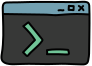

## Hola soy Renee Magallanes - RFMC22 

:mailbox: ¡Contáctame!:

### :books: Actualmente estoy aprendiendo

<code></code>

### Tecnologias que conozco

<code></code>
<code></code>
<code></code>
<code></code>
<code></code>
<code></code>
<code></code>
<code></code>
<code></code>
<code></code>

  
:zap: GitHub Stats

